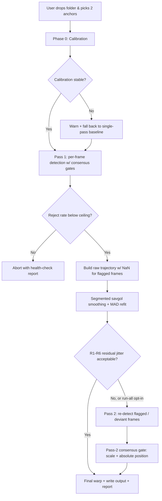

# Stabilization Quality Pass

## Problem Frame

On representative 3500–3800 frame batches, the translation-only two-anchor
stabilizer produces output with **occasional wrong-perforation latches** as
the most visible failure: the detector jumps to an adjacent perforation
for a few frames and the locked anchor pops, followed by residual jitter
and long-run drift. Three root causes compound:

1. **Weak bootstrap.** The first frame's template and perforation spacing
   are detected once, greedily, with no cross-check against the rest of
   the batch. If that first estimate is wrong, every downstream gate
   inherits the error.
2. **Per-frame detection decides alone.** The current motion predictor
   uses EMA on the last delta and rejects frames farther than
   `0.5 · perf_spacing` from the prediction. It has no knowledge of where
   the anchor *should* be globally, so a wrong-perf latch passes all
   local gates.
3. **Failed frames leak.** When either anchor fails, the frame is
   NaN-filled and later interpolated by segment savgol. During bright
   flashes or sprocket damage this drops a real motion signal on the
   floor.

The three improvements in the recently-completed ideation
(`docs/ideation/2026-04-23-stabilization-quality-rethink-ideation.md`)
interlock: Calibration produces the stable scale/NCC baselines that
Consensus uses to reject wrong latches, and both feed the smoothed
trajectory that the Two-Pass prior re-detects against. Design is
unified (shared calibrated state). Release is staged: R1–R6
(Calibration + Consensus) is the primary-pain fix and ships first;
R7–R9 (Two-Pass) is contingent on residual jitter still being
unacceptable after R1–R6 validates (see R14).

## User Flow

## Requirements

**Terminology.** A frame is *flagged* when pass 1 cannot produce a
trusted two-anchor observation for it. "Flagged" is the umbrella term;
three disjoint subtypes drive it: *motion-rejected* (candidate too far
from the EMA prediction), *consensus-rejected* (candidate violates the
calibrated scale / cross-anchor constraint), and *NaN-filled* (template
match failed outright on that anchor). Counters are reported
separately; smoothing and pass-2 operate on the union.

**Calibration (Phase 0)**

- R1. Before per-frame tracking begins, the pipeline runs a calibration
  phase on N frames sampled evenly across the batch (default: N=30,
  clamped to batch size; costs one extra I/O pass) to jointly
  estimate: perforation spacing, per-anchor template shape, and a
  reference NCC distribution (top-peak and runner-up percentiles
  under normal conditions). Sampling across the batch (rather than
  first-N) hardens against damaged/spliced openings.
- R2. Calibration must produce stability estimates — perf spacing and
  reference NCC must be consistent across the calibration window (e.g.,
  spacing standard deviation below a configurable fraction of the mean,
  NCC median above a floor). If calibration fails to stabilize, the
  pipeline falls back to the current single-frame bootstrap
  (translation-only, no new consensus gates, no pass 2) and emits a
  prominent "calibration-unverified" warning in the run summary. A
  strict mode (hard abort instead of fallback) is available as an
  opt-in flag for advanced users. Hard abort is not the default:
  Diego's workflow must always produce *some* output, even if
  degraded.
- R3. Calibration outputs are logged in the run summary so a user can
  see the detected spacing, template sizes, and NCC baseline after a
  run.

**Anchor-Pair Consensus**

- R4. Every frame's two candidate anchor positions are cross-checked
  against two constraints derived from the Phase-0 calibrated
  baseline (never from on-the-fly recomputation): (a) inter-anchor
  *separation* must match the calibrated separation within tolerance
  (scale gate); (b) each anchor's *absolute pixel position* must stay
  within a perf-spacing-scale bound of the calibrated anchor position
  across the batch (global-drift gate). (b) is the defense against
  symmetric dual-anchor latch — if both anchors jump to the same
  adjacent perf, (a) passes but (b) catches it. Frames that violate
  either are flagged as consensus-rejected.
- R5. When one anchor is confident and the other is ambiguous or
  flagged, the pipeline uses single-anchor fallback (translation-only
  from the confident anchor). Because R4's scale gate is unavailable
  with one anchor, the fallback applies a replacement check: the
  confident anchor's position must lie within a bounded deviation
  (default: 0.5 · perf_spacing) from the smoothed-trajectory prior
  for that frame. Frames that fail the replacement check fall through
  to R6.
- R6. When both anchors are flagged (or R5's replacement check
  fails), the frame is dropped to NaN for smoothing to fill. The run
  summary reports three disjoint counters — motion-rejected,
  consensus-rejected, and NaN-filled — so the user can distinguish
  failure modes.

**Two-Pass Prior**

- R7. After pass 1 produces a raw trajectory and segmented savgol
  smoothing produces the smoothed trajectory, the pipeline runs a
  second detection pass that uses the smoothed trajectory as a strong
  per-frame prior (expected anchor position + tight search window)
  instead of the EMA predictor.
- R8. Pass 2 runs on at minimum all flagged frames and on frames
  whose raw position deviates from the smoothed trajectory by more
  than a configured threshold. On frames where the smoothed prior is
  fabricated (no real observations within `window_length / 2` on
  either side — i.e., a fully-interpolated NaN region), pass 2 must
  either widen the search window to pass-1 scale or skip the frame
  entirely. Running pass 2 on every frame is acceptable given the 2×
  runtime budget, but is not required.
- R9. Pass 2 results replace pass 1 results only when **all** three
  conditions hold: (i) pass-2 confidence exceeds pass-1 confidence
  measured *at the same search-window size* (or exceeds a calibrated
  margin if windows differ — deferred tuning); (ii) pass-2 positions
  satisfy the same R4 scale + global-drift gates against the
  **original** Phase-0 calibrated baseline, never against a
  pass-2-recomputed baseline; (iii) the frame was flagged by pass 1,
  or pass-2's candidate lies within the smoothed prior's local noise
  scale. Conditions (i)–(iii) together break the feedback loop where
  a tight pass-2 window on a contaminated prior confidently confirms
  a wrong latch.

**Integration & Observability**

- R10. Calibration outputs — perf spacing, per-anchor template
  dimensions, NCC baselines, per-anchor reference vector — are
  computed once in Phase 0 and reused by Pass 1, Consensus, and
  Pass 2 without re-derivation. The representation (dataclass, dict,
  attributes on an existing tracker) is a planning decision; the
  requirement is behavioral, not architectural.
- R11. The existing `stabilization_report.txt` gains calibration
  outputs, consensus-rejected count, and pass-2 replacement count.
  The Electron UI's existing counter row gains parallel entries for
  the same three. "Existing counter row" = the row already rendering
  motion-rejected; no new panels, modals, or screens.
- R12. Validation covers Diego's representative batch as the primary
  target plus at least one secondary batch selected for contrast
  (different lighting, splice density, or exposure). Both must pass
  "zero visible wrong-perf latches on playback"; residual jitter must
  be "not worse than current pipeline" on the primary batch. A
  before/after clip (current pipeline vs. this quality pass) for
  each batch is archived alongside the run outputs as the
  reproducible acceptance artifact.
- R13. Pass-1 health check. After Pass 1 completes and before
  smoothing runs, the pipeline checks the combined reject rate
  (motion-rejected + consensus-rejected + NaN-filled, treating
  splice-segment NaN separately so splices don't inflate the
  count). If the non-splice reject rate exceeds a configurable
  ceiling (default: 20%), the pipeline aborts with a health-check
  report naming the dominant failure mode. This is symmetric to R2:
  R2 catches bad bootstrap, R13 catches bad per-frame tracking. Both
  are configurable, both default to "stop and surface the problem"
  rather than "produce invented-trajectory output."
- R14. Mid-plan gate between R1–R6 and R7–R9. The implementation plan
  must validate R1–R6 against the representative batch (wrong-perf
  latches not visible on playback, residual jitter measured) before
  committing to R7–R9. If R1–R6 alone produces acceptable output,
  R7–R9 is deferred to a follow-on pass. R7–R9 is not unconditional
  scope; the "unified pass" framing is about shared design, not a
  shared release.

## Success Criteria

- **Primary**: on the representative batch plus at least one secondary
  batch (R12), wrong-perforation latches are not visible on playback.
- **Secondary**: residual jitter is not visible on playback on the
  representative batch.
- **Quantitative floors** (objective, run in `stabilize_folder`'s
  existing summary): combined non-splice reject rate stays below
  R13's ceiling; zero consensus-rejected frames that turn out to be
  real perforations on manual spot-check of flagged indices; pass-2
  replacements concentrate on flagged frames, not good ones.
- **Non-regression**: on clean stretches of the primary batch,
  output is no worse than the current pipeline — pass 2 must not
  introduce new jitter by over-correcting confident frames. The
  archived before/after clip (R12) is the evidentiary artifact.
- **Calibration-failure happy path**: batches where Phase 0
  destabilizes still produce output via the R2 fallback path; the
  run summary surfaces the "calibration-unverified" warning so the
  user knows the output used the old baseline.

## Scope Boundaries

- **Architecture is fixed**: template matching + two-anchor rigid +
  segmented savgol stays. No ML models, no optical flow, no Kalman
  filter replacement of savgol.
- **No UX overhaul.** The two-anchor click flow, preview, and
  progress UI stay as-is. New signals surface only in the existing run
  summary.
- **No new IPC messages** beyond what the current JSON-lines protocol
  already expresses. Calibration status and counters ride on existing
  `log` and `done` message types.
- **Rotation is currently applied in the warp.** Verified from source:
  `src/perforation_stabilizer_app.py:837-846` constructs the warp
  matrix from `cos(theta_s[idx])` / `sin(theta_s[idx])`, and
  `rigid_fit_2pt` in `src/trajectory_smoothing.py:84` still returns
  theta. Commit `0c0c330`'s title ("translation-only") is
  misleading — rotation was not fully removed. This pass must
  explicitly decide: continue applying theta, zero it out, or use it
  only as a consensus signal (R4). This is a live architectural
  decision, not a scope note.
- **Validation is intentionally light but evidentiary.** R12 requires
  two batches and an archived before/after clip, but no full
  regression harness, no labeled test set, no formal client
  acceptance loop this pass.
- **Not in scope**: confidence-weighted savgol (ideation idea #5),
  gradient/edge-space NCC (idea #4), arc-length/local-poly NaN fill
  (idea #7). These remain in the ideation backlog.
- **Otsu shape sanity gate (ideation idea #6) is reconsidered, not
  rejected.** Flagged by product-lens review: low complexity,
  directly targets bright-rectangular imposters (a wrong-perf-latch
  root cause). Deferred here only because R4's scale + absolute-
  position gates should catch the same failure class; if planning
  finds those gates insufficient on the representative batch, #6 is
  the first idea pulled from the backlog.

## Key Decisions

- **Unified design, staged release.** The three ideas share calibrated
  state and compound in quality, so the *design* is unified. But R14
  separates release: R1–R6 ships and is validated first; R7–R9 ships
  only if residual jitter on the representative batch is unacceptable
  after R1–R6. This addresses the goal-work misalignment (primary
  pain is wrong-perf latch, which R1–R6 handles) without losing the
  shared-state architecture.
- **Primary pain = wrong-perf latch, primary signal = playback.**
  Requirements prioritize latch prevention (Calibration + Consensus)
  over jitter reduction (Two-Pass). Acceptance is visual but also
  archives a before/after clip per R12.
- **2× runtime is a ceiling, not a commitment.** Pass 2 defaults to
  running on flagged + deviant frames only (R8 minimum path).
  "Every frame" is opt-in, not default. This keeps wall-clock
  predictable before planning measures the true baseline.
- **Calibration-failure fallback, not abort.** R2 falls back to the
  current single-frame bootstrap with a warning rather than
  producing zero output. Hard abort is an opt-in strict mode for
  advanced use. Reasoning: Diego's workflow must always produce
  *some* output, and the user-visible warning is sufficient to
  flag a degraded run.
- **Symmetric health check instead of silent degradation.** R13
  mirrors R2's loud-failure semantics for per-frame tracking: if
  more than a configurable fraction of non-splice frames end up
  flagged, the run stops with a report. This is the circuit breaker
  that prevents the pass-2 feedback loop from rubber-stamping a
  largely-invented trajectory.
- **Single-anchor fallback before NaN-drop.** R5 recovers partial
  information rather than deferring to smoothing. Because R4's scale
  gate is unavailable with one anchor, R5 uses a deviation-from-prior
  replacement check — consensus is preserved, not waived.
- **Pass-2 guarded by global baselines.** R9's replacement
  conditions use the **original** Phase-0 calibration as the sanity
  reference, never a pass-2-recomputed one. This prevents the
  feedback loop where a bad pass 1 contaminates the smoother,
  which contaminates the pass-2 prior, which confidently confirms
  the bad pass 1.

## Dependencies / Assumptions

- The theta question is not an assumption: rotation IS applied today
  (see Scope Boundaries above). The architectural decision — keep,
  zero, or use only as a signal — must be resolved during planning.
- Calibration needs at least ~30 frames of usable footage at the start
  of each batch. Very short batches (<30 frames) are not a target use
  case for Diego but should fail gracefully.
- The representative batch is assumed to be repeatable (same frames,
  same anchors) so before/after comparisons are meaningful.

## Outstanding Questions

### Resolve Before Planning

- [Affects R9][Product Decision] "Confidence" metric for pass-2 vs.
  pass-1 comparison. Flagged by multiple reviewers as load-bearing
  for R9's non-regression guarantee — raw NCC from a tight pass-2
  window is systematically higher than raw NCC from pass-1's wider
  window, so a naive comparison will always favor pass-2 and defeat
  R9's "never degrades a good pass-1 frame" claim. Options: (a)
  compare at equal window size, (b) require pass-2 to beat pass-1 by
  a calibrated margin, (c) use `_rank_candidates` combined score
  instead of raw NCC.
- [Affects R1][Product Decision] First-N vs. sampled-N for calibration
  window. Sampling is more robust to damaged/spliced starts (the most
  likely failure mode on analog film) but costs one extra I/O pass
  and delays first output. Default must be named, not deferred,
  because R2's stability thresholds depend on it.

### Deferred to Planning

- [Affects R2][Needs research] What's the right spacing-stability
  threshold (std/mean ratio) and NCC-median floor for R2's fallback
  trigger? Needs empirical tuning against the representative batch.
- [Affects R4][Technical] Scale tolerance for the inter-anchor
  constraint — absolute pixels vs. percentage of separation — and
  the absolute-position bound for the global-drift gate. Depends on
  how much real rotation/shear exists in the client's footage.
- [Affects R7][Technical] Prior search window size on pass 2 — tight
  enough to prevent re-latching on wrong perfs, loose enough to catch
  genuine motion the smoother under-estimated.
- [Affects R8][Technical] Deviation threshold for "re-detect this
  frame" on pass 2. Likely a multiple of the smoothed series' local
  noise scale.
- [Affects R9][Technical] Calibrated margin for pass-2-vs-pass-1
  confidence comparison when window sizes differ, once the metric in
  Resolve-Before-Planning is chosen.
- [Affects R10][Technical] State-invalidation policy across splices —
  is the Phase-0 calibrated state immutable for the whole run, or
  re-calibrated per splice segment? Current assumption: immutable.
- [Affects R11][Technical] Exact serialization of calibration state
  into `stabilization_report.txt` and parallel counter entries in
  the Electron UI.
- [Affects R13][Needs research] Default ceiling for the non-splice
  reject rate. Needs baseline measurement: what does the current
  pipeline report on the representative batch today?
- [Affects R12][Logistics] Which secondary batch(es) will Diego
  provide, and at what point in planning are they delivered?
- [Affects R8][Needs measurement] Current pipeline wall-clock on the
  representative batch, to validate whether the 2× budget is an
  acceptable absolute runtime or just a comfortable multiplier.
- [Affects R2, R13][User decision] Is Diego running batches attended
  (able to react to a warning or abort) or overnight/background
  (needs fully automatic behavior)? Affects how R2's fallback and
  R13's abort are surfaced.

## Next Steps

→ `/ce:plan` for structured implementation planning
