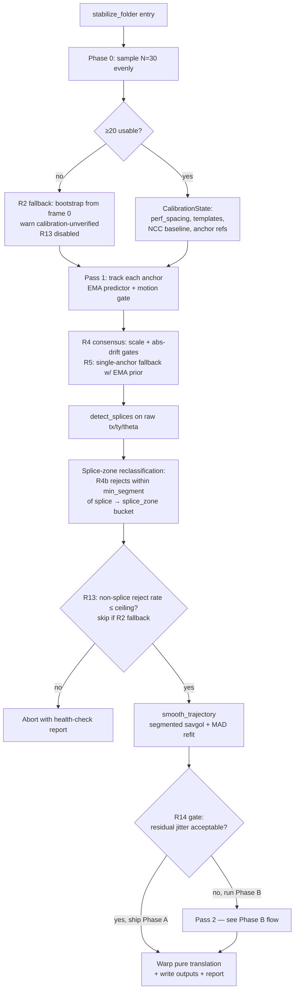
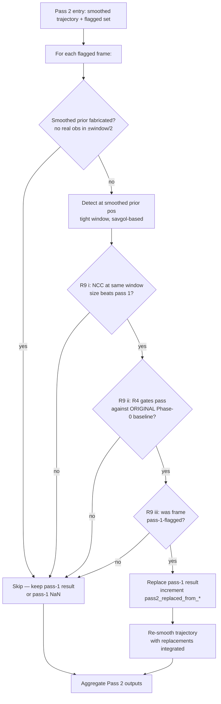

# Stabilization Quality Pass — Calibration, Consensus, Two-Pass Prior

## Overview

Three stacked additions to the existing two-anchor template-matching stabilizer
(see origin: `docs/brainstorms/2026-04-23-stabilization-quality-pass-requirements.md`):

1. **Phase 0 calibration** — sample 30 frames evenly across the batch to
   estimate perforation spacing, per-anchor template shape, and a reference
   NCC distribution before tracking begins. Falls back to single-frame
   bootstrap (with a "calibration-unverified" warning) when calibration
   destabilizes; opt-in strict mode aborts instead.
2. **Anchor-pair consensus** — scale gate + absolute-position drift gate
   against the calibrated baseline, single-anchor fallback (R5), three
   disjoint rejection counters, and splice-aware retroactive
   reclassification.
3. **Two-pass smoothed prior** (R7–R9, gated by R14) — pass 2 rescues
   pass-1-flagged frames using the segmented-savgol trajectory as a prior;
   replacement requires equal-window-size NCC dominance, the same R4 gates
   against the **original** Phase-0 baseline, and a frame-scope guard
   ensuring confident pass-1 frames are immutable.

The plan also closes the gap between commit `0c0c330`'s "translation-only"
title and the warp code at `src/perforation_stabilizer_app.py:837-846`,
which still applies rotation. Theta becomes a consensus / splice signal
only; the warp output uses pure translation.

Phase A (Units 1–8) ships first and is validated against the
representative batch and ≥1 secondary batch. Phase B (Units 9–11) is
contingent on R14's mid-plan gate.

## Problem Frame

On Diego's 3500–3800 frame batches, the current pipeline produces output
with three failure modes that compound:

- **Wrong-perf latch** — the detector locks onto an adjacent perforation;
  the current motion gate (`±0.5 · perf_spacing`) accepts the latch
  because it has no global reference for where the anchor *should* be.
- **Bootstrap fragility** — perforation spacing and templates are
  detected from frame 0 only; if frame 0 is damaged or atypical, every
  downstream gate inherits the error.
- **Information loss to NaN** — when one anchor fails, the frame is
  NaN-filled and segment savgol fills the gap, dropping a real motion
  signal on the floor during bright flashes or sprocket damage.

Rotation is also live in the warp despite the commit message saying
otherwise. The plan resolves both correctness (translation-only intent)
and detection quality together.

## Requirements Trace

From `docs/brainstorms/2026-04-23-stabilization-quality-pass-requirements.md`:

- **R1.** Calibration Phase 0 on 30 frames sampled evenly across the
  batch (resolved during brainstorm).
- **R2.** Calibration-failure → single-frame fallback with
  "calibration-unverified" warning. Opt-in strict mode for hard abort.
- **R3.** Calibration outputs surfaced in run summary.
- **R4.** Per-frame consensus: (a) inter-anchor scale gate vs. calibrated
  baseline, (b) per-anchor absolute-position global-drift gate vs.
  calibrated anchor reference position.
- **R5.** Single-anchor fallback with deviation-from-prior replacement
  check (default: 0.5 · perf_spacing).
- **R6.** Three disjoint rejection counters: motion-rejected,
  consensus-rejected, NaN-filled.
- **R7.** Pass-2 detection using smoothed savgol trajectory as per-frame
  prior.
- **R8.** Pass 2 runs on flagged frames + frames whose raw position
  deviates from the smoothed trajectory beyond a threshold; **skips**
  frames whose smoothed prior is fabricated (no real observations within
  `window_length / 2`) — see Key Technical Decisions for rationale.
- **R9.** Pass-2 replacement requires (i) equal-window-size NCC dominance
  over pass 1 (resolved during brainstorm); (ii) R4 gates pass against
  the **original** Phase-0 baseline; (iii) the frame was pass-1-flagged.
  See Key Technical Decisions for the (iii) "or" → "and" resolution.
- **R10.** Calibration outputs computed once; reused by Pass 1, Consensus,
  Pass 2 without re-derivation.
- **R11.** `stabilization_report.txt` and the Electron renderer counter
  row gain calibration outputs + three rejection counters + pass-2
  replacement counters.
- **R12.** Validation against ≥1 secondary batch + archived before/after
  clip per batch.
- **R13.** Pass-1 health check: abort if non-splice reject rate > 20%
  (configurable).
- **R14.** Mid-plan gate: validate Phase A (R1–R6) against the
  representative batch before committing to Phase B (R7–R9).

## Scope Boundaries

- **Architecture is fixed**: template matching + two-anchor rigid +
  segmented savgol stays. No ML, no optical flow, no Kalman replacement.
- **No UX overhaul**: two-anchor click flow, preview, and progress UI
  unchanged. Counters surface only in the existing run summary.
- **No new IPC message types**: calibration status and counters ride on
  existing `progress`, `log`, and `done.summary` messages.
- **Not in scope**: confidence-weighted savgol, gradient/edge-space NCC,
  arc-length NaN fill, Otsu shape sanity gate (deferred backlog).
- **Validation is light but evidentiary**: ≥1 secondary batch and an
  archived before/after clip per batch. No full regression harness.

## Context & Research

### Relevant Code and Patterns

- **Pipeline orchestration**: `src/perforation_stabilizer_app.py` —
  `stabilize_folder` is the only public entry; current shape is
  bootstrap → two `_track_anchor_pass` calls → optional debug pass →
  `detect_splices` + `smooth_trajectory` → warp pass. Three full-frame
  reads today (a1 track + a2 track + warp; debug is a 4th conditional
  read).
- **Tracker pass**: `_track_anchor_pass` returns 6 parallel arrays
  (`positions, nccs, amb, rej, fail, outcomes`) destructured positionally
  by its single caller. Adding consensus state forces growth of the
  return shape — Unit 4 promotes this to a dataclass.
- **Per-frame detection**: `_locate_anchor_in_frame` already does
  ROI-cropped grayscale + top-K NCC + motion-plausibility gating.
  Pass-2 will reuse it with a swapped predictor (savgol prior instead
  of EMA).
- **Existing motion predictor**: `_MotionPredictor` (EMA, α=0.6) — kept
  for Pass 1; replaced for Pass 2.
- **Spacing detection**: `_detect_perf_spacing` returns None when <3
  perforations resolved; current call site raises `RuntimeError`. Phase
  0 will call this on each sampled frame and aggregate.
- **Trajectory smoothing**: `src/trajectory_smoothing.py` —
  `rigid_fit_2pt` returns `(tx, ty, theta)`; `smooth_trajectory` exposes
  `window`, `polyorder`, `mad_multiplier`. Per-segment MAD is computed
  but currently discarded — Unit 9 surfaces it as the local noise scale.
  `_interp_nans` does the linear gap fill that creates "fabricated
  prior" regions when run length exceeds `window_length / 2`.
- **Splice detection**: `detect_splices` consumes per-anchor NCC arrays
  + raw `tx/ty/theta`; merges short segments via `min_segment` (default
  30). Reusable for the splice-zone reclassification in Unit 6.
- **Electron summary surface**: `electron/renderer/renderer.js:335-356`
  — string-concatenation `parts.push(...)` pattern joined with `·`. New
  counters extend by adding `parts.push` lines and reading numeric
  summary fields with `?? 0`. No DOM layout change required.
- **CLI surface**: `src/stabilizer_cli.py` — argparse flags;
  Electron-side mirror in `electron/main.js:117-152`. Any new CLI flag
  must be added in both branches.
- **Warp construction**: `src/perforation_stabilizer_app.py:837-846`
  builds the affine matrix from `cos(theta_s)` / `sin(theta_s)`. Unit
  3 zeroes the rotation in this matrix only — `rigid_fit_2pt` and
  `detect_splices` continue to compute / consume theta as a signal.
- **Test patterns**: `tests/test_detection.py` uses synthetic frames
  via `make_frame` + `_tri_frame` helpers; class-per-area
  organization. `tests/test_trajectory_smoothing.py` uses analytic
  signals (linear ramps, injected spikes, synthetic step at frame 200
  for splice tests). New `tests/test_calibration.py` follows the same
  pattern.

### Institutional Learnings

- **`docs/solutions/best-practices/post-refactor-review-checklist-dead-code-stale-references-2026-04-14.md`**:
  - Guard numeric values crossing process boundaries — every new
    summary field must be `Number.isFinite()`-checked on the Electron
    side.
  - Never silently swallow exceptions — calibration-fallback path must
    log the transition, not just continue.
  - Audit every parameter the public API accepts — `stabilize_folder`
    gains several config knobs in this plan; each must be plumbed
    end-to-end (CLI → call site → consumers) and asserted dead-free.
  - Deduplicate per-item operations in hot loops — pass 2 must not
    recompute ROI grayscale that pass 1 already did. Cache the
    pass-1 NCC response map per frame for pass-2 reuse.
  - Replace magic numbers that duplicate defaults — derive thresholds
    from calibrated baselines (`baseline_ncc`, `baseline_spacing`)
    rather than literals.

### External References

External research skipped this plan — local patterns are well-established
(template matching, savgol, two-anchor rigid fit), the user is deeply
familiar with the codebase, and the genuine novelty (tracker+smoother
feedback coupling) was already mitigated at the requirements level via
R9's three AND-conditions, R13's circuit breaker, and R14's gate.

## Key Technical Decisions

The flow analyzer surfaced gaps that were not product-blockers but
required a single answer to make the plan coherent. These resolutions
are committed here with rationale:

- **Rotation is zeroed in the warp output** (resolves I4). Commit
  `0c0c330`'s title intent ("translation-only") is realized — the warp
  affine becomes pure translation. `rigid_fit_2pt` continues to compute
  theta because `detect_splices` uses it as a discontinuity signal,
  and the global-drift gate (R4b) needs a stable rotation reference.
  Reasoning: the plan's primary failure mode is X/Y wrong-perf latch;
  rotation introduces additional warp variance with no current quality
  benefit, and zeroing it makes R4b's "absolute pixel position" comparison
  unambiguous.

- **R5 prior depends on which pass is running** (resolves C1). In
  Pass 1, R5's "smoothed-trajectory prior" is the EMA `_MotionPredictor`
  (the only prior available before savgol runs). In Pass 2, R5 uses
  the segmented savgol trajectory from Pass 1. Single-pass runs
  (R14-gated off) use only the EMA prior in R5. This is the only
  responsible answer — savgol cannot exist before tracking completes,
  and the EMA predictor already has the locality R5 needs.

- **Splice-vs-R4b: retroactive reclassification** (resolves C2). The
  R4b absolute-drift gate is evaluated inside the per-frame tracker
  (no other place to evaluate it). After Pass 1 + `detect_splices`
  resolve, frames flagged consensus-rejected within `min_segment`
  frames of any splice boundary (other than splice 0 = batch start)
  are reclassified into a `splice_zone` bucket. Splice-zone frames
  do not contribute to `consensus_rejected_frames_*` counters and
  are excluded from R13's denominator. This preserves R4b's value
  (catching wrong-perf latch) without false-rejecting legitimate
  post-splice film offsets.

- **Counter partitioning: three disjoint rejections + ambiguous +
  pass-2 sub-counters** (resolves C3, I5). The "three disjoint
  rejection counters" specified in R6 are evaluated in this priority
  order per frame:
  - **NaN-filled** — both anchors failed entirely (no candidate);
    frame contributes 0 information.
  - **Consensus-rejected** — at least one anchor produced a candidate
    but R4 (scale or abs-drift) flagged it; if R5 rescues, the
    frame is *not* counted as consensus-rejected.
  - **Motion-rejected** — at least one anchor's top candidate was
    motion-gated (existing `_FrameOutcome.motion_rejected` semantics).
  - **Ambiguous** — informational only (existing); frame still
    produces a position via predicted fallback. Not part of the three
    disjoint rejection counters.
  Pass-1 counters are immutable. Pass 2 adds three non-overlapping
  sub-counters: `pass2_replaced_from_motion`,
  `pass2_replaced_from_consensus`, `pass2_replaced_from_nan`. Their
  sums must satisfy `sum ≤ pass-1 parent counter`.

- **R9(iii): "or" resolves to "and"** (resolves C4). Pass 2 rescues
  ONLY frames pass-1-flagged. Confident pass-1 frames are immutable.
  Reasoning: the spec's Success Criteria require "pass 2 must not
  introduce new jitter by over-correcting confident frames." The
  "or" branch in R9(iii) directly contradicts that guarantee. The
  conservative resolution preserves the non-regression promise.

- **target_x / target_y echo the user click** (resolves C5). The
  calibration baseline `anchorN_ref` used by R4b and R9(ii) is also
  the user click, **not** the median observed position. Storing the
  median as the gate baseline would propagate calibration
  contamination into the "ORIGINAL baseline" R9(ii) trusts (Adversarial
  P0). The median is recorded as a separate diagnostic
  (`calibration_observed_median_a1_x/y`) so we can flag clicks that
  appear off-perf, but it does not gate. If the click-to-median
  divergence exceeds 0.25 · perf_spacing, calibration emits a
  specific warning so the user can re-click.

- **Phase 0 success threshold: ≥20/30 sampled frames must yield a
  usable per-anchor bbox + spacing + NCC percentile** (resolves I1).
  Below 20/30 → R2 fallback. The 67% floor mirrors the spec's
  "stability" intent without inventing a more granular tiering.

- **Phase 0 I/O failure: skip-and-continue** (resolves I2).
  Unreadable sampled frames are skipped, not retried. If effective N
  drops below 20 → R2 fallback (same path as quality-driven failure).

- **Pass 2 skips fabricated-prior frames** (resolves I3, R8). On
  frames whose smoothed prior is purely interpolated (no real
  observations within `window_length / 2 = 25` frames on either
  side), pass 2 does not run. Reasoning: a fabricated prior carries
  no real signal; running pass 2 against it risks the exact
  feedback loop R9 is designed to prevent.

- **R13 timing: post-splice-detect, pre-smoothing** (resolves I6).
  After Pass 1 + `detect_splices` complete, R13 computes
  `(motion + consensus + nan_filled - splice_zone) / (n - splice_zone)`.
  Health check then decides abort vs. continue. If R2 fallback is
  active, R13 is **disabled** (no calibrated baseline → no consensus
  rejections → reject rate would be miscalibrated).

- **UI progress sub-ranges** (resolves I7). The single `progress`
  scalar is divided as: 0.00–0.02 calibration, 0.02–0.50 Pass 1
  (a1 + a2 tracking), 0.50–0.55 smoothing + splices + R13,
  0.55–0.95 Pass 2 if active OR jump to warp 0.55–1.00 if Phase B
  off, 0.95–1.00 warp. Phase markers emitted as `log` lines (e.g.,
  `Calibrating…`, `Pass 1: tracking…`, `Health check passed`).

- **Single-pass `_track_anchor_pass` shape** (R10 representation).
  The function evolves from a 6-tuple-of-arrays return to a small
  dataclass `TrackPassResult` carrying the existing arrays plus the
  consensus-rejection mask and the cached per-frame pass-1 NCC
  values (used in pass-2 same-window comparison). Calibration state
  is passed in as a `CalibrationState` dataclass parameter. This
  is a behavioral, not an API, change — the function remains
  module-private.

## Open Questions

### Resolved During Planning

- *R9 confidence metric* → Equal-window-size NCC comparison.
  Resolved during brainstorm. Pass 2 must compute NCC at the same
  window size as Pass 1's chosen position to compare. Implementation
  in Unit 10.
- *R1 calibration sampling* → 30 frames sampled evenly across the
  batch. Resolved during brainstorm. Implementation in Unit 1.
- *Phase 0 partial-success threshold* → ≥20/30 (67%). See Key
  Technical Decisions.
- *R8 widen vs. skip on fabricated priors* → Skip. See Key Technical
  Decisions.
- *Rotation in warp* → Zero. See Key Technical Decisions.
- *Splice + R4b interaction* → Retroactive reclassification. See Key
  Technical Decisions.
- *Counter partitioning* → Priority order NaN > consensus > motion;
  ambiguous orthogonal. See Key Technical Decisions.

### Deferred to Implementation

- **R4 scale tolerance** — absolute pixels vs. percentage of separation,
  and the absolute-position bound for R4b. Depends on measurement on
  the representative batch. Implementer to start with 5% scale
  tolerance and 1.0 · perf_spacing absolute-drift bound, then tune
  empirically before Unit 8 (R13 ceiling).
- **R7 pass-2 search window size** — tight enough to prevent re-latch,
  loose enough to catch genuine motion. Implementer to start with
  0.4 · perf_spacing and tune via Unit 11 validation.
- **R8 pass-2 deviation threshold** — multiple of smoothed-series local
  noise scale. Implementer to start with 3 × MAD-derived sigma and
  tune.
- **R13 default ceiling** — needs baseline measurement of current
  pipeline reject rate on the representative batch. Default 20% as a
  starting point per the spec; validate against baseline before
  shipping Unit 8.
- **R12 secondary batch** — Diego provides; logistics. Plan blocks at
  R14 gate until at least one secondary batch is available.
- **R8 wall-clock budget** — measure pass-1-only runtime on the
  representative batch before Unit 9 to confirm 2× ceiling is an
  acceptable absolute number.
- **`stabilization_report.txt` exact field names** — see Unit 7 for
  the proposed schema; final names land with implementation.

## High-Level Technical Design

> *This illustrates the intended approach and is directional guidance for
> review, not implementation specification. The implementing agent should
> treat it as context, not code to reproduce.*

### Phase A flow (R1–R6 + R13)



### Phase B flow (R7–R9, R8 skip rule)



### Tracker state shape evolution

```text
Before:
  _track_anchor_pass(...) -> (positions, nccs, amb, rej, fail, outcomes)
  6 parallel lists, destructured positionally by stabilize_folder.

After Unit 4 (Phase A fields only):
  _track_anchor_pass(..., calibration: CalibrationState | None) -> TrackPassResult

  TrackPassResult fields:
    positions:           list[(x, y) | None]
    nccs:                list[float | None]
    ambiguous_mask:      list[bool]
    motion_rejected:     list[bool]
    consensus_rejected:  list[bool]   # new (populated by Unit 5)
    failed_mask:         list[bool]
    outcomes:            list[_FrameOutcome]

After Unit 10 (Phase B extends the dataclass when needed):
    pass1_ncc_at_pos:    list[float | None]   # added in Phase B only —
                                              # for pass-2 same-window comparison
```

This shape is module-private and may evolve during implementation
without an API contract.

## Implementation Units

### Phase A — Calibration + Consensus (R1–R6, R10–R13)

- [ ] **Unit 1: Calibration Phase 0 module**

**Goal:** New module that scans 30 evenly-sampled frames and returns a
`CalibrationState` dataclass (or `None` on failure).

**Requirements:** R1, R10.

**Dependencies:** None.

**Files:**
- Create: `src/calibration.py`
- Create: `tests/test_calibration.py`

**Approach:**
- Module exposes `run_calibration(files, anchor1, anchor2, *, n_samples=30, log)
  -> CalibrationState | None`.
- `CalibrationState` dataclass carries: `perf_spacing` (float),
  `template_a1` (np.ndarray, grayscale), `template_a2` (np.ndarray,
  grayscale), `anchor1_ref` (x, y), `anchor2_ref` (x, y),
  `ncc_top_p50` (float), `ncc_top_p10` (float),
  `ncc_runner_up_p50` (float), `effective_n` (int),
  `sampled_indices` (list[int]).
- Sample indices: `np.linspace(0, len(files) - 1, n_samples).astype(int)`,
  then de-duplicate while preserving order (handles N<30 batches).
- For each sampled file: read with `cv2.imread`; on failure, skip and
  continue (logged at debug level). Build per-anchor template via
  existing `_build_perforation_template`. Run `_detect_perf_spacing`
  on the cropped ROI around anchor1 to estimate spacing. Run a
  top-K NCC scan to record `(top_ncc, runner_up_ncc)` for each anchor.
- Aggregate: median spacing, median template dims (round to existing
  bbox-detector output), median NCC percentiles. `anchorN_ref` IS the
  user click (verbatim) — the median observed position is recorded
  separately as `observed_median_a1_x/y` for diagnostic purposes
  (off-perf-click detection). If
  `|user_click - median_observed| > 0.25 · perf_spacing`, emit a
  click-off-perf warning; calibration may still succeed but the
  warning surfaces a likely user error.
- Stability check: ≥20 of 30 sampled frames must yield usable
  spacing + bboxes + NCC values. Spacing std/mean < 0.1
  (configurable). NCC top-p50 must be > 0.5 baseline floor.
- Return `None` on stability failure or `effective_n < 20`. Caller
  handles fallback.

**Execution note:** Implement test-first. The dataclass shape and the
≥20/30 threshold are testable without integration plumbing.

**Patterns to follow:**
- `src/perforation_stabilizer_app.py:_build_perforation_template`,
  `_detect_perf_spacing`, `_template_match_candidates`.
- `tests/test_detection.py` `make_frame` + `_tri_frame` synthetic
  fixtures; class-per-area organization.

**Test scenarios:**
- *Happy path:* synthetic 60-frame batch with consistent spacing →
  `CalibrationState` returned with `effective_n == 30`, `perf_spacing`
  matches synthetic spacing within 0.5px.
- *Happy path:* batch of length 50 with `n_samples=30` →
  `sampled_indices` has 30 unique values evenly distributed.
- *Edge case:* batch shorter than `n_samples` (N=10, n_samples=30) →
  `sampled_indices` clamps to N=10; `effective_n` reflects truth;
  returns `None` (below 20-floor) without crashing.
- *Edge case:* batch with N=30 but 11 unreadable frames →
  `effective_n=19` → returns `None`.
- *Edge case:* batch with N=30 but spacing varies wildly across
  samples (std/mean > 0.1) → returns `None`.
- *Error path:* anchor click outside frame bounds → returns `None`
  with logged reason.
- *Integration:* `CalibrationState` round-trips through
  `stabilization_report.txt` formatter (test that
  `f"perf_spacing: {state.perf_spacing}"` produces a parseable line).

**Verification:**
- New unit tests pass.
- `ruff check src/calibration.py` clean.
- Module is importable but not yet wired into `stabilize_folder`.

---

- [ ] **Unit 2: Wire calibration into `stabilize_folder` with R2 fallback**

**Goal:** Replace the single-frame bootstrap call to `_detect_perf_spacing`
with the new `run_calibration`. On failure, fall back to the old
single-frame path with a "calibration-unverified" warning. Add
`--strict-calibration` CLI flag for hard-abort opt-in.

**Requirements:** R2, R3, R10.

**Dependencies:** Unit 1.

**Files:**
- Modify: `src/perforation_stabilizer_app.py` (`stabilize_folder` bootstrap
  section, lines ~654–704).
- Modify: `src/stabilizer_cli.py` (add `--strict-calibration` flag).
- Modify: `electron/main.js` (mirror `--strict-calibration` flag in
  both packaged and dev arg-builder branches).
- Modify: `tests/test_detection.py` (`TestAnchorWorkflow` cases that
  drive `stabilize_folder` end-to-end need ≥22 synthetic frames or
  a low-N test path). Add a shared helper
  `_make_calibration_batch(tmpdir, n=22, frame_factory=_tri_frame)`
  in the test module to keep fixture cost contained to one place.
  Specific tests requiring growth or a fallback variant:
  `test_stabilize_with_anchor_produces_output` (line ~538),
  `test_summary_reports_two_anchor_metrics` (line ~656),
  `TestDebugFrames.test_debug_jpeg_created_for_failed_frame`
  (line ~724), `test_raises_when_neither_anchor_detected_anywhere`
  (line ~694).

**Approach:**
- Call `run_calibration` first. If it returns `CalibrationState`, store
  it on a local variable threaded into Unit 4. If it returns `None`:
  - Strict mode → raise `RuntimeError` with the cause.
  - Default mode → log a prominent "calibration-unverified" warning,
    fall back to the existing `_detect_perf_spacing(first_frame, anchor1)`
    bootstrap, build templates from frame 0 only, record
    `calibration_status: "fallback"` in the summary, and disable R13
    (Unit 8) for this run.
- Summary fields added: `calibration_status` (`"ok"` | `"fallback"`),
  `calibration_perf_spacing_px`, `calibration_ncc_median`,
  `calibration_effective_n`, `calibration_sampled_indices`.
- Strict-mode CLI flag: `--strict-calibration`. Default off. Surface
  via the existing `argparse` setup in `src/stabilizer_cli.py`. Pass
  through `stabilize_folder(strict_calibration=...)` kwarg.
- Electron `main.js` builds the flag from a future UI option (not
  added in this unit; CLI surface is the contract). Today, default
  off behavior matches existing UX.

**Execution note:** Add characterization coverage for the existing
single-frame bootstrap path before refactoring it (most current
tests exercise it implicitly).

**Patterns to follow:**
- Existing summary-field flow at `stabilize_folder` lines 868–909.
- Existing `_detect_perf_spacing` raise pattern at lines 694–699 (the
  strict-mode path mirrors it).
- Electron arg-builder pattern at `electron/main.js:117-152`.

**Test scenarios:**
- *Happy path:* synthetic 60-frame stable batch →
  `summary["calibration_status"] == "ok"`,
  `summary["calibration_effective_n"] == 30`.
- *Happy path:* synthetic 30-frame batch with frame 0 damaged →
  calibration stabilizes anyway because sampling is across-batch;
  `calibration_status == "ok"`.
- *Fallback path:* synthetic 5-frame batch (below 20-floor) →
  `calibration_status == "fallback"`, warning emitted, frame 0
  bootstrap used, output produced (no abort).
- *Strict mode:* same 5-frame batch with `strict_calibration=True` →
  `RuntimeError` raised; no output written.
- *Integration:* CLI flag `--strict-calibration` sets the kwarg
  correctly (verify via mocked `stabilize_folder` in CLI tests).
- *Integration:* `stabilization_report.txt` contains the new fields
  in flat key/value form.

**Verification:**
- All existing `TestAnchorWorkflow` tests still pass after the bootstrap
  is replaced (or are explicitly updated to cover the new path).
- New summary keys appear in `tests/test_detection.py`'s schema
  assertion.
- Electron build still launches correctly without the new flag (default
  off behavior preserved).

---

- [ ] **Unit 3: Zero rotation in the warp output**

**Goal:** The warp affine becomes pure translation. `rigid_fit_2pt`
continues to compute theta; `detect_splices` continues to consume it;
the warp matrix uses identity rotation.

**Requirements:** Closes the Scope-Boundaries note in the origin doc
("rotation is currently applied"). Prerequisite for R4b's "absolute
pixel position" being unambiguous.

**Dependencies:** None (independent of Units 1–2).

**Files:**
- Modify: `src/perforation_stabilizer_app.py` warp loop (lines
  ~837–846).
- Modify: `tests/test_detection.py` `TestTwoAnchorStabilization` cases
  that may rely on rotation in the warp.

**Approach:**
- Replace `c, s = cos(theta_s[idx]), sin(theta_s[idx])` with
  `c, s = 1.0, 0.0` in the warp matrix construction.
- Leave `theta_raw` / `theta_s` arrays in place — they remain inputs to
  `detect_splices` and to the R4b gate's stability check.
- Add a one-line comment at the warp site explaining that rotation is
  computed but intentionally not applied (the WHY: completes commit
  `0c0c330`'s intent and preserves R4b's translation-only semantics).
  This is one of the rare places where a comment is warranted because
  the divergence between theta computation and theta application is
  non-obvious.

**Patterns to follow:**
- Existing `cv2.warpAffine` call shape and `border_mode` / `inv_tx` /
  `inv_ty` derivation.

**Test scenarios:**
- *Happy path:* synthetic batch where frames are translated only, no
  rotation → output unchanged from current pipeline (this is the
  non-regression case).
- *Edge case:* synthetic batch with 0.5° rotation between frames →
  output is no longer rotation-corrected; anchors translate-only;
  residual rotation is visible. Test asserts the rotation is *not*
  applied (cos == 1.0 in the matrix).
- *Integration:* `TestSearchRadiusInvariant` and similar geometric
  tests still pass.

**Verification:**
- `tests/test_detection.py` tests pass.
- Warp matrix at the modified site uses identity rotation under any
  input; verified by a unit test that calls `stabilize_folder` and
  inspects the synthetic output for translation-only behavior.

---

- [ ] **Unit 4: Promote `_track_anchor_pass` return shape; thread CalibrationState**

**Goal:** Refactor `_track_anchor_pass` to return a `TrackPassResult`
dataclass instead of a 6-tuple. Accept `CalibrationState | None` as a
parameter. No behavior change in this unit — pure refactor that
enables Units 5–7.

**Requirements:** R10 (representation choice).

**Dependencies:** Unit 1 (CalibrationState type), Unit 2 (caller
already has the state to pass).

**Files:**
- Modify: `src/perforation_stabilizer_app.py` (`_track_anchor_pass`
  signature + return; both call sites in `stabilize_folder`; debug-
  frame loop that consumes the per-frame `outcomes` list).
- Modify: `tests/test_detection.py` if any test directly destructures
  the tuple (grep for the call shape).

**Approach:**
- Define `TrackPassResult` dataclass alongside `_FrameOutcome`. Phase A
  fields only: `positions`, `nccs`, `ambiguous_mask`,
  `motion_rejected`, `consensus_rejected` (initialized to all-False
  here; populated in Unit 5), `failed_mask`, `outcomes`. Do NOT add
  `pass1_ncc_at_pos` here — it lands with Unit 10 (Phase B) when it
  has a consumer. Avoids dead-field tax if R14 ships Phase A only.
- `_track_anchor_pass` accepts `calibration: CalibrationState | None`
  parameter (defaults to `None`); does not consume it yet — Unit 5
  uses it.
- Update both `stabilize_folder` call sites to consume named fields
  via `result.positions`, etc.

**Execution note:** Characterization-first. Add a smoke test that
calls `_track_anchor_pass` with synthetic input and asserts the
dataclass shape before changing the return type.

**Patterns to follow:**
- `_FrameOutcome` namedtuple at `src/perforation_stabilizer_app.py:28-30`
  (similar shape, but use `@dataclass` for mutability of new
  fields).

**Test scenarios:**
- *Happy path:* synthetic batch → `TrackPassResult` returned;
  `len(positions) == n_frames`; `consensus_rejected` is all-False
  (no consensus logic yet).
- *Edge case:* `calibration=None` → behaves identically to before
  the refactor.
- *Integration:* end-to-end `stabilize_folder` synthetic test still
  produces the same `summary` (no behavior change).

**Verification:**
- Existing `TestAnchorWorkflow` and `TestTwoAnchorStabilization`
  tests pass unchanged.
- Static check: no positional destructuring of `_track_anchor_pass`
  remains in the codebase.

---

- [ ] **Unit 5: R4 consensus gates + R5 single-anchor fallback**

**Goal:** Implement the per-frame scale gate, absolute-drift gate, and
single-anchor fallback with deviation-from-EMA-prior replacement check.
Populates `consensus_rejected` flags and the new
`consensus_rejected_frames_a1/a2` summary fields.

**Requirements:** R4, R5, R6 (rejection partitioning).

**Dependencies:** Units 2 (calibration state available) and 4
(dataclass to populate).

**Files:**
- Modify: `src/perforation_stabilizer_app.py` (consensus check loop —
  evaluated **after** both `_track_anchor_pass` calls return, since
  the gate is cross-anchor).
- Modify: `tests/test_detection.py` (new `TestAnchorPairConsensus`
  class).

**Approach:**
- After both anchor passes complete and before `detect_splices`,
  iterate each frame index:
  - If both anchors have `None` position → mark frame `nan_filled`
    (no R4 evaluation).
  - If exactly one anchor has a position → R5 path. Compute
    deviation between the confident anchor's position and the EMA
    predictor's prediction at that frame index (replay the predictor
    over the confident anchor's positions to get a per-frame
    expected position). If deviation ≤ 0.5 · perf_spacing → keep;
    else → mark anchor consensus-rejected, frame becomes
    `nan_filled` if both end up rejected.
  - If both anchors have positions → R4. Compute current separation
    `|a2_pos - a1_pos|` and compare to
    `|calibration.anchor2_ref - calibration.anchor1_ref|`. Within
    5% → scale gate passes. Compute per-anchor offset from
    `calibration.anchorN_ref`. Within `1.0 · perf_spacing` →
    drift gate passes. Either gate failing on either anchor →
    mark that anchor `consensus_rejected`. If both anchors get
    consensus-rejected, fall through to R5 (try single-anchor with
    the better-scoring one).
- Populate `consensus_rejected` mask in `TrackPassResult`. Add summary
  fields `consensus_rejected_frames_a1`, `consensus_rejected_frames_a2`,
  `nan_filled_frames`.
- When R2 fallback is active, R4 gates use the bootstrap-derived
  baseline (which is just frame 0 — gates degrade to "is frame 0
  consistent with itself", effectively pass-through). Document that
  R5 still functions in fallback (uses EMA only, not calibration).

**Execution note:** Implement test-first. R4's gating logic is a pure
function that can be tested in isolation before the integration
plumbing.

**Patterns to follow:**
- Existing `motion_rejected_frames_a1/a2` summary field semantics at
  `stabilize_folder` lines 872–877.
- `_FrameOutcome.motion_rejected` flag pattern.

**Test scenarios:**
- *Happy path:* synthetic batch where both anchors stay near
  calibrated reference → no consensus rejections.
- *Happy path:* synthetic batch where one anchor occasionally jumps
  to wrong perf (offset by 1 · perf_spacing) → R4b drift gate
  catches it; R5 rescues using the other anchor; frame still
  produces output.
- *Edge case:* frame where both anchors latch to wrong perf (same
  offset) → R4a scale passes (same separation) but R4b drift fails
  on both → both marked consensus-rejected → R5 fails (no confident
  anchor) → frame `nan_filled`.
- *Edge case:* frame with one anchor fully failed (None) and the
  other deviating from EMA prior by 0.6 · perf_spacing → R5
  replacement check fails → anchor marked consensus-rejected →
  frame `nan_filled`.
- *Edge case:* R2 fallback active → consensus gates pass-through; no
  R4 rejections counted; only R5 EMA check active.
- *Edge case:* counter disjointness — a frame must not appear in
  both `motion_rejected_a1` and `consensus_rejected_a1`. Priority:
  if motion-rejected, do not evaluate consensus.
- *Integration:* end-to-end synthetic batch produces a summary with
  matching counter sums (`motion + consensus + nan = total
  rejections`).

**Verification:**
- New `TestAnchorPairConsensus` tests pass.
- Existing tests (`TestAnchorWorkflow` etc.) pass with new fields
  defaulting to 0 on clean batches.
- Counter disjointness invariant asserted in at least one test.

---

- [ ] **Unit 6: Splice-aware retroactive reclassification** *(deferred to follow-on plan)*

> **Status:** Deferred to a follow-on plan. Document review found
> this unit speculative — it defends against a failure mode (R4b
> false-rejecting post-splice frames) not yet observed on Diego's
> batches, and the splice-zone bucket can silently absorb real
> wrong-perf latches that happen to land near a splice. Defer
> until R14 evidence shows Phase A's R4b causes false-aborts via
> R13 in real runs. In the interim, R13's denominator uses the
> raw consensus-rejected count (no splice-zone subtraction) — a
> conservative choice (higher apparent reject rate) over a
> permissive one (silently dropping frames from accounting).
>
> If R14 evidence requires this unit, the safer behavior is:
> splice-zone frames REMAIN in `consensus_rejected_*` counters for
> accounting purposes; only the R13 denominator subtracts them.
> This preserves auditability of latches near splice boundaries.

**Goal (when revived):** After `detect_splices` resolves splice
boundaries, frames flagged `consensus_rejected` within `min_segment`
of any splice boundary (other than the implicit splice at index 0)
have R13's denominator adjusted to exclude them, but the
`consensus_rejected_*` counter still reflects the raw rejection.

**Requirements:** R4 (preserves gate value across splices), R6,
R13 (denominator excludes splice zones).

**Dependencies:** Unit 5 (consensus mask), `detect_splices` (already
exists).

**Files:**
- Modify: `src/perforation_stabilizer_app.py` (post-splice
  reclassification block, after `detect_splices` returns).

**Approach:**
- After `detect_splices` returns `splice_indices` (sorted ints
  including 0), compute `splice_zone_mask` over n frames:
  `mask[i] = True` if `i ≥ min_segment` AND there exists a splice
  boundary `s > 0` in the window `[i - min_segment, i]`.
- For each frame `i` with `splice_zone_mask[i] == True`:
  - If consensus-rejected on either anchor → unset that flag,
    decrement the corresponding counter, increment a new
    `splice_zone_frames_a1/a2` counter.
- Splice-zone frames are still NaN-filled in the trajectory (they
  carry no positions); smoothing fills them as before. The
  reclassification only affects counter accounting and R13's
  denominator.

**Patterns to follow:**
- `detect_splices` segment-merging logic at
  `src/trajectory_smoothing.py:159-171`.

**Test scenarios:**
- *Happy path:* synthetic batch with one mid-batch translation step
  of 2 · perf_spacing at frame 100 → `detect_splices` returns
  `[0, 100]`; frames 100..129 (`min_segment` = 30) that were
  consensus-rejected are reclassified to `splice_zone`; counter
  delta is accurate.
- *Edge case:* splice at index 0 (batch start) → no reclassification
  triggered (the implicit start is not a real splice boundary).
- *Edge case:* two adjacent splices at frames 100 and 120 (closer
  than `min_segment`) → `detect_splices` already merges them;
  reclassification window is `[120, 149]`.
- *Edge case:* consensus-rejected frame at index 95 (just before
  splice at 100) → not reclassified (window is forward-only from
  the splice).
- *Integration:* a batch with splices + true wrong-perf latches in
  non-splice regions → only the latches stay in
  `consensus_rejected`; splice boundary frames go to
  `splice_zone`.

**Verification:**
- New tests in `tests/test_detection.py` (or a new
  `tests/test_consensus_splice.py` if scope grows).
- Counter sum invariant:
  `consensus_rejected_a1 + splice_zone_frames_a1 ==
  (consensus_rejected_a1 from Unit 5)` before reclassification.

---

- [ ] **Unit 7: UI counter row + `stabilization_report.txt` schema**

**Goal:** Surface the new counters in both the Electron summary row
and the on-disk report. No new IPC message types — fields ride on
existing `done.summary`.

**Requirements:** R3, R6, R11.

**Dependencies:** Units 2, 5, 6 (all summary fields populated).

**Files:**
- Modify: `electron/renderer/renderer.js` (summary-row assembly,
  lines ~335–356).
- Modify: `src/perforation_stabilizer_app.py`
  (`stabilization_report.txt` formatter at lines ~898).
- Modify: `tests/test_detection.py` (schema assertion update at
  `test_summary_reports_two_anchor_metrics`).

**Approach:**
- Renderer: extend the existing `parts.push(...)` chain. Order:
  motion-rejected (existing), consensus-rejected (new), splice-zone
  (new, optional — skip when 0), pass-2 replacement (new, populated
  in Phase B). Each new entry guarded with `?? 0` and `Number.isFinite()`
  per institutional learnings.
- Add a separate calibration-status badge in the same row when
  `calibration_status === 'fallback'` — e.g., text
  `"calibración: no verificada"` rendered in the existing warning
  log style. Use Spanish to match existing UI strings.
- `stabilization_report.txt` formatter: list-valued keys
  (`splice_indices`, `calibration_sampled_indices`) keep the existing
  `f"{k}: {v}\n"` shape; nested calibration outputs are flattened to
  scalar keys (not nested dicts).
- Field name proposal (final names land with implementation):
  `calibration_status`, `calibration_perf_spacing_px`,
  `calibration_ncc_median`, `calibration_effective_n`,
  `calibration_sampled_indices`, `consensus_rejected_frames_a1/a2`,
  `nan_filled_frames`, `splice_zone_frames_a1/a2`,
  `pass2_replaced_from_motion`, `pass2_replaced_from_consensus`,
  `pass2_replaced_from_nan`.

**Patterns to follow:**
- Existing `parts.push` rendering at `renderer.js:341-353`.
- Existing report formatter loop at `stabilize_folder` lines
  ~898–905.

**Test scenarios:**
- *Happy path:* synthetic clean batch → renderer shows existing
  motion-rejected count; new counters all 0 and either suppressed
  (when 0) or rendered as `0 rechazadas por consenso` (decision
  per implementation; recommend suppress-when-zero).
- *Edge case:* fallback mode → renderer shows
  `"calibración: no verificada"` warning chip.
- *Edge case:* batch with non-finite summary value (corrupt input) →
  renderer renders `0` instead of `NaN`/`undefined`.
- *Integration:* `stabilization_report.txt` round-trips: write and
  re-read the same key/value pairs the test asserts on.

**Verification:**
- `tests/test_detection.py:test_summary_reports_two_anchor_metrics`
  updated to cover all new keys.
- Manual verification: launch Electron app on a synthetic batch and
  confirm the summary row renders cleanly with no `undefined` /
  `NaN` artifacts.

---

- [ ] **Unit 8: R13 pass-1 health check + circuit breaker**

**Goal:** After Pass 1 completes, splices are detected, and Unit 6
reclassifies, compute the non-splice reject rate. If above the
configurable ceiling (default 20%) and R2 fallback is not active,
abort with a health-check report instead of proceeding to smoothing.

**Requirements:** R13.

**Dependencies:** Units 5, 6 (final counters).

**Files:**
- Modify: `src/perforation_stabilizer_app.py` (new check between
  `detect_splices` and `smooth_trajectory`).
- Modify: `src/stabilizer_cli.py` (add `--reject-ceiling` CLI flag,
  default `0.20`).
- Modify: `electron/main.js` (mirror flag in arg builder).
- Modify: `tests/test_detection.py` (new `TestHealthCheck` class).

**Approach:**
- Define `class HealthCheckError(RuntimeError)` in
  `src/perforation_stabilizer_app.py` with attributes `numerator`,
  `denominator`, `rate`, `dominant_mode`. Distinguishes structured
  abort from generic exceptions.
- Compute `denominator = n_frames` (Unit 6 splice-zone subtraction
  is deferred; ship with raw denominator).
- Compute `numerator = motion_rejected_total + consensus_rejected_total
  + nan_filled_frames`.
- **Default behavior is WARN, not ABORT.** If
  `denominator > 0 AND rate > ceiling AND not fallback_mode`:
  - Log a prominent warning identifying the dominant failure mode
    (e.g., "consensus rejections dominated: 24% of frames; consider
    re-clicking anchors or running with --strict-health-check").
  - Surface in `stabilization_report.txt` as
    `health_check: warning` with the rate and dominant mode.
  - Continue to smoothing + warp — Diego always gets output.
- **Strict mode (opt-in, `--strict-health-check`):** raises
  `HealthCheckError` instead of warning. Bubbles up to CLI which
  emits a JSON-lines `error` message with `subtype: "health_check"`
  for renderer differentiation.
- Default ceiling: 0.20, but the value is calibrated against the
  current pipeline's measured baseline before R14 (see Open
  Questions). If baseline rate > 15%, raise default ceiling to
  `1.5 × baseline_rate` to avoid false-firing on first runs.
- R2 fallback path skips R13 entirely (already noted in Unit 2's
  summary fields).

**Patterns to follow:**
- Existing `RuntimeError` pattern at `stabilize_folder:694-699` for
  the abort path.
- `src/stabilizer_cli.py:74-75` JSON-lines `error` message emission.

**Test scenarios:**
- *Happy path:* synthetic batch with 5% rejection rate → R13 passes;
  smoothing proceeds.
- *Edge case:* ceiling = 0.20, rejection rate = 0.21 → R13 aborts;
  no warp output; report written.
- *Edge case:* batch entirely composed of splice-zone frames after
  reclassification (denominator = 0) → R13 passes (degenerate; no
  rejection rate to compute).
- *Edge case:* R2 fallback active and rejection rate = 0.30 → R13
  skipped; pipeline produces output (graceful degradation per spec).
- *Error path:* `HealthCheckError` is distinguishable from generic
  `RuntimeError` in CLI output and tests.
- *Integration:* `--reject-ceiling 0.50` raises the threshold; tests
  drive the CLI and assert the abort condition shifts.

**Verification:**
- New `TestHealthCheck` tests pass.
- Ceiling default of 0.20 documented in CLI help and CLAUDE.md.
- CLI flag visible in `stabilizer_cli.py --help` output.

---

### R14 — Mid-Plan Validation Gate

After Unit 8 ships and is reviewed, validate Phase A end-to-end on
the representative batch + ≥1 secondary batch (R12). Produce
before/after clips for each batch (current pipeline vs. Phase A) and
archive them alongside the run outputs.

**Gate decision:**
- *Phase A acceptable* — wrong-perf latches not visible on playback;
  residual jitter "not worse than current pipeline" → Phase B is
  deferred to a follow-on plan; this plan ships at Unit 8.
- *Phase A insufficient* — residual jitter remains visible on the
  representative batch → proceed to Phase B (Units 9–11).

This gate is a process step, not a code unit. It blocks until Diego
provides the secondary batch (deferred-to-implementation logistics).

---

### Phase B — Two-Pass Smoothed Prior (R7–R9)

> *Phase B units are blocked on the R14 gate. Do not start until the
> gate decision is "proceed to Phase B".*

- [ ] **Unit 9: Pass-2 prior infrastructure (smoothed trajectory + local noise scale)**

**Goal:** Surface the per-segment local noise scale from
`smooth_trajectory` (currently computed via MAD then discarded).
Provide a `SmoothedPrior` accessor that gives `(predicted_pos,
local_noise_sigma, is_fabricated)` for each frame index.

**Requirements:** R7, R8 (skip rule), R9 (iii noise scale).

**Dependencies:** Phase A complete; R14 gate decision = proceed.

**Files:**
- Modify: `src/trajectory_smoothing.py` (`smooth_trajectory` returns
  an extended tuple including per-frame local sigma).
- Create or modify: helper `SmoothedPrior` accessor (location TBD —
  either inline in `trajectory_smoothing.py` or `perforation_
  stabilizer_app.py`; implementer's choice).
- Modify: `tests/test_trajectory_smoothing.py`.

**Approach:**
- `smooth_trajectory` currently computes per-segment MAD on residuals
  (line ~258). Capture this and return a per-frame
  `local_sigma_tx/ty` array (broadcast each segment's MAD * 1.4826
  to its frames).
- Define "fabricated prior" per frame: a frame `i` is fabricated if
  there is no real (non-NaN) observation within `±window_length / 2`
  (default ±25) frames in the *raw* trajectory. Compute via a
  sliding-window mask over `np.isfinite(tx_raw)`.
- `SmoothedPrior(idx) -> (predicted_pos_a1, predicted_pos_a2,
  local_sigma, is_fabricated)`. The per-anchor positions come from
  inverting the rigid transform: `tx_s/ty_s` are batch-frame deltas;
  per-anchor predicted position = `calibration.anchorN_ref +
  (tx_s[idx], ty_s[idx])` (rotation is zeroed per Unit 3).

**Execution note:** Implement test-first for the noise-scale and
fabricated-prior signals. Both are pure numeric functions.

**Patterns to follow:**
- Existing segment loop in `smooth_trajectory` at
  `trajectory_smoothing.py:246-270`.

**Test scenarios:**
- *Happy path:* clean synthetic trajectory → `local_sigma` is small
  (sub-pixel) and roughly uniform; `is_fabricated` is all False.
- *Happy path:* trajectory with one injected outlier at frame 100 →
  `local_sigma` for that segment reflects the outlier's MAD
  contribution (or MAD-refit attenuation depending on outlier mask).
- *Edge case:* run of 60 consecutive NaNs (longer than 2 ×
  window_length / 2) → middle of the run has `is_fabricated = True`;
  edges within ±25 of a real observation are False.
- *Edge case:* trajectory with NaN at frame 0 → `is_fabricated`
  for frame 0 is True (no real obs in `[-25, 25]` if frames 0–25
  are also NaN).
- *Integration:* `SmoothedPrior(idx)` round-trips through
  `calibration.anchorN_ref` to give a position in image
  coordinates that matches the raw trajectory on clean stretches.

**Verification:**
- New tests pass.
- `smooth_trajectory` return shape change is contained — caller
  in `stabilize_folder` updated to consume the new field.
- No existing trajectory-smoothing tests break.

---

- [ ] **Unit 10: Pass-2 detection w/ same-window-size NCC + R9 gates**

**Goal:** Run a second pass over flagged frames + frames whose raw
position deviates from the smoothed trajectory beyond a threshold.
Use `SmoothedPrior` as the per-frame predictor. Compute NCC at the
same search-window size as Pass 1 for the comparison.

**Requirements:** R7, R8 (rescue eligibility), R9 (i, ii).

**Dependencies:** Unit 9, plus `pass1_ncc_at_pos` populated in Unit
4's `TrackPassResult`.

**Files:**
- Modify: `src/perforation_stabilizer_app.py` (new `_pass_2_detect`
  function or extension of `_track_anchor_pass`).
- Modify: `tests/test_detection.py` (new `TestPass2` class).

**Approach:**
- For each anchor, build the rescue set: `flagged_frames = motion |
  consensus | nan_filled` plus
  `deviant_frames = |raw - smoothed| > 3 * local_sigma` (excluding
  splice-zone, fabricated-prior, and confident pass-1 frames per
  R9(iii)).
- For each candidate frame: get the smoothed prior position; build a
  tight ROI around it (deferred config: 0.4 · perf_spacing); call
  `_locate_anchor_in_frame` (or a thin variant) with the prior as the
  predictor. Returns a candidate position + tight-window NCC.
- Compute the same-window NCC at the chosen tight position using the
  Pass-1 search radius (for direct comparison with `pass1_ncc_at_pos`).
- R9(i): tight pass-2 NCC must beat `pass1_ncc_at_pos` *measured at
  same window size* by ≥0.02 (deferred tuning).
- R9(ii): the candidate position must satisfy R4 gates against the
  **original** Phase-0 baseline (`calibration.anchor1_ref`,
  `calibration.anchor2_ref`, calibrated separation). Re-uses the
  Unit 5 gating logic.
- R9(iii): the frame must be in the flagged set. Confident pass-1
  frames (not flagged) are immutable, even if they appear deviant
  from the smoothed trajectory.
- If all three pass → replace pass-1 position; mark
  `pass2_replaced_from_*` based on the original rejection cause.

**Execution note:** Implement test-first. R9 is the highest-risk
gate in the plan and benefits from RED tests for each AND-clause
before implementation.

**Patterns to follow:**
- `_locate_anchor_in_frame` ROI + grayscale + NCC pattern at
  `perforation_stabilizer_app.py:460-540`.
- Unit 5's R4 gating logic.

**Test scenarios:**
- *Happy path:* synthetic batch with a wrong-perf latch on frame
  100 only → Pass 1 marks frame 100 motion-rejected; Pass 2
  replaces with the correct position; `pass2_replaced_from_motion ==
  1`.
- *Edge case:* Pass-2 candidate beats Pass-1 NCC at tight window
  but fails R4 against ORIGINAL baseline (e.g., the candidate is
  itself a wrong-perf at a different location) → no replacement;
  `pass2_replaced_*` counters unchanged.
- *Edge case:* Pass-2 candidate position is a confident pass-1
  frame (not flagged) but deviates significantly from smoothed →
  R9(iii) blocks; no replacement.
- *Edge case:* fabricated-prior frame in rescue set →
  `is_fabricated` skip rule (Unit 9's R8) blocks before NCC is
  computed.
- *Edge case:* tight-window pass-2 NCC at the candidate position is
  *higher* than pass-1, but wide-window NCC at the same position
  is *lower* (would have lost in Pass 1) → R9(i)'s same-window
  comparison rejects the replacement (this is the feedback-loop
  prevention case).
- *Integration:* a batch that runs through the full Pass A + Pass B
  produces correct `pass2_replaced_from_*` counters;
  pass-1 parents are immutable (sums match Phase A counters).

**Verification:**
- New `TestPass2` tests pass; each AND-clause has at least one
  positive and one negative case.
- Counter invariants hold:
  `pass2_replaced_from_X ≤ phase_A_counter_X` for every X.

---

- [ ] **Unit 11: Re-smooth after Pass 2; counters + Phase B summary fields**

**Goal:** Integrate Pass-2 replacements into the smoothed trajectory
(re-run `smooth_trajectory` on the updated raw arrays); add Phase B
counters to the summary; surface the pass-2 totals in the renderer
and report (extending Unit 7's surface).

**Requirements:** R7, R11.

**Dependencies:** Unit 10.

**Files:**
- Modify: `src/perforation_stabilizer_app.py` (re-smooth call after
  Pass 2; summary field aggregation).
- Modify: `electron/renderer/renderer.js` (extend the parts.push
  chain with pass-2 totals).
- Modify: `tests/test_detection.py` (extend Pass-2 integration
  tests).

**Approach:**
- After Unit 10 produces replacement positions, rebuild
  `tx_raw/ty_raw/theta_raw` arrays. Call
  `detect_splices` + `smooth_trajectory` again with the updated
  inputs. The second smoothing pass operates on a higher-signal
  trajectory.
- Aggregate Phase B counters: `pass2_replaced_from_motion`,
  `pass2_replaced_from_consensus`, `pass2_replaced_from_nan`,
  `pass2_skipped_fabricated`, `pass2_skipped_r9_i`,
  `pass2_skipped_r9_ii`, `pass2_skipped_r9_iii` (the breakdown of
  "why not rescued" is useful for tuning).
- Renderer: append `· N pass-2 rescues` (suppress if 0). Skip
  reasons go to `log` lines, not the summary row.

**Patterns to follow:**
- Unit 7's renderer extension shape.
- Existing two-pass smoothing call shape (single call today; the
  second call is structurally identical).

**Test scenarios:**
- *Happy path:* synthetic batch with 3 wrong-perf latches → all 3
  rescued; final smoothed trajectory has lower MAD residual than
  Phase-A-only run on the same input.
- *Non-regression:* synthetic clean batch → Pass 2 makes 0
  replacements; final smoothed trajectory is identical to
  Phase-A-only output (bit-equal or within float tolerance).
- *Integration:* re-smoothing does not introduce new splice
  detections (the original splice indices should still hold;
  if they shift, that's a signal the Pass-2 changes were too
  aggressive).
- *Integration:* renderer shows `pass2_replaced` total when
  populated; suppresses when 0.

**Verification:**
- Non-regression test: clean-batch output is bit-identical to
  Phase-A-only output.
- Pass-2 counters surface correctly in summary + renderer.
- Before/after clip on the representative batch demonstrates no
  new jitter introduced on confident frames (Success Criteria
  non-regression evidence).

---

## System-Wide Impact

- **Interaction graph:** `stabilize_folder` is the central hub.
  Touched callers: `src/stabilizer_cli.py` (run_batch), `electron/main.js`
  (subprocess args), `tests/test_detection.py` (most integration
  tests). Touched callees: `src/calibration.py` (new),
  `src/trajectory_smoothing.py` (extended return shape, Unit 9). No
  other modules involved.
- **Error propagation:** `HealthCheckError` (Unit 8) and the strict-
  mode calibration `RuntimeError` (Unit 2) bubble through
  `stabilize_folder` to the CLI's top-level try/except in `run_batch`,
  which already converts exceptions to JSON-lines `error` messages.
  Electron renderer already handles `error` types — no new IPC.
- **State lifecycle risks:** The 5th read pass introduced by Phase 0
  (sampled calibration) compounds the existing 3-read setup. With
  Phase B, a 6th read pass (Pass 2 partial) is added. The Pass-2
  read is per-rescue-frame (sparse), so the average read count
  remains <5 on clean batches. Diego's batches are 3500–3800 JPEGs
  on local SSD — measured baseline must confirm no I/O ceiling is
  hit before R14.
- **API surface parity:** `stabilizer_cli.py` gains `--strict-
  calibration` and `--reject-ceiling`. Both are mirrored in
  `electron/main.js` arg builder. No breaking change to existing
  flags. JSON-lines protocol unchanged.
- **Integration coverage:** end-to-end `TestAnchorWorkflow` cases
  must still pass with synthetic frames after each unit lands.
  Most existing integration tests use 3–5 synthetic frames; the new
  ≥30-frame requirement (for calibration) means several existing
  tests need to either (a) grow to 30 frames or (b) explicitly
  drive the R2 fallback path. Plan-level decision: prefer (a) for
  tests that exercise the happy path and (b) for tests that
  intentionally test small-batch behavior.
- **Unchanged invariants:**
  - The two-anchor click flow (UX) is unchanged.
  - JSON-lines IPC message types (`progress`, `log`, `done`,
    `error`, `preview`) are unchanged.
  - `target_x` / `target_y` echo the user click verbatim
    (Key Decision C5).
  - Output folder convention (`*_ESTABILIZADO`) is unchanged.
  - `_FrameOutcome.motion_rejected` semantics (predictor not
    updated on rejection; pt is None) are preserved by Unit 5.
  - PyInstaller binary build path is unchanged (no new external
    dependencies).

## Risks & Dependencies

| Risk | Likelihood | Impact | Mitigation |
|------|-----------|--------|------------|
| Phase B feedback loop: pass-2 confidently confirms a wrong pass-1 latch | Med | High | R9 three-AND-gate (i ii iii); R13 circuit breaker; same-window NCC comparison; non-regression clean-batch test |
| `_track_anchor_pass` refactor (Unit 4) breaks debug-frame loop | Low | Med | Characterization-first execution note on Unit 4 |
| 5+ I/O passes on 3800-frame batches exceed acceptable wall-clock | Med | Med | Measure baseline before R14; cache pass-1 NCC response maps for pass-2 reuse (institutional learning); pass-2 is sparse per-rescue-frame |
| Existing tests that use 3–5 synthetic frames break under calibration `effective_n ≥ 20` floor | High | Low | Plan-level decision documented in System-Wide Impact; tests grow or drive fallback |
| Calibration false-fail on a legitimately variable batch (e.g., heavy density variation) | Med | Med | R2 fallback ensures output still produced; warning surfaces the degradation |
| Splice-zone reclassification mis-classifies real wrong-perf latches near splices as splice_zone | Low | Med | `min_segment` window is 30 frames — narrower than typical wrong-perf latch persistence; counter sums make this auditable |
| Rotation-zeroing (Unit 3) introduces visible residual rotation on batches with real tilt | Low | Low | Diego's batches are translation-dominant per spec; if real rotation matters, future plan re-introduces theta as a separate signal-only gate |
| R14 gate stalls indefinitely if Diego doesn't provide secondary batch | Med | Med | Phase A is independently shippable; Phase B blocks on R14 gate but does not block Phase A delivery |
| New summary fields with non-finite values crash Electron renderer | Low | Low | `Number.isFinite()` guards on all new field reads (institutional learning) |

## Documentation / Operational Notes

- `CLAUDE.md` updates: add `--strict-calibration` and
  `--reject-ceiling` to the CLI flag listing in the Architecture
  section. Mention Phase 0 calibration in the pipeline description.
- `stabilization_report.txt` schema is documented inline in
  `stabilize_folder` and asserted in tests; no separate schema file.
- The R12 archived before/after clips (per batch) live under
  `docs/validation/2026-04-23-stabilization-quality-pass/` (new
  directory). One subdirectory per batch with `before.mp4`,
  `after.mp4`, and a `notes.md` describing observations. This is
  the evidentiary artifact called out in the Success Criteria.
- After Unit 8 ships, manually verify the Electron app still launches
  and produces output on a real batch (per the project-memory
  feedback "Always run full build + open .app after any code change
  to the Electron app or Python backend"). The build-iniciado-en-
  background hook handles the first half automatically; the open-
  and-test step is manual.

## Phased Delivery

### Phase A — Calibration + Consensus (Units 1–8)

Ships first. Validates the primary failure-mode fix (wrong-perf
latch) without committing to the riskier two-pass infrastructure.
Each unit is independently commitable.

Recommended commit order: Unit 3 (rotation zero, smallest blast
radius, completes prior commit's intent) → Unit 1 (calibration
module, no integration) → Unit 4 (refactor, no behavior change) →
Unit 2 (wires calibration in) → Unit 5 (R4 gates) → Unit 6 (splice
reclassification) → Unit 7 (UI surface) → Unit 8 (R13 health
check). This order keeps each step independently testable and
reviewable.

### R14 Validation Gate

Process step. Manual validation against representative batch + ≥1
secondary batch. Produces archived before/after clips. Decides
whether Phase B is needed.

### Phase B — Two-Pass Smoothed Prior (Units 9–11)

Contingent on R14. Adds the second detection pass with savgol prior.
Highest-risk units in the plan because of the feedback-loop concern;
the three-AND-gate in R9 plus R13's circuit breaker are the
mitigations. Non-regression on clean batches is the load-bearing
acceptance test.

## Sources & References

- **Origin document:** [docs/brainstorms/2026-04-23-stabilization-quality-pass-requirements.md](../brainstorms/2026-04-23-stabilization-quality-pass-requirements.md)
- **Ideation:** [docs/ideation/2026-04-23-stabilization-quality-rethink-ideation.md](../ideation/2026-04-23-stabilization-quality-rethink-ideation.md)
- **Prior plan establishing two-anchor + savgol architecture:** [docs/plans/2026-04-19-002-feat-multi-anchor-and-global-trajectory-smoothing-plan.md](2026-04-19-002-feat-multi-anchor-and-global-trajectory-smoothing-plan.md)
- **Prior plan establishing three-counter disjointness:** [docs/plans/2026-04-19-001-fix-post-refactor-review-findings-plan.md](2026-04-19-001-fix-post-refactor-review-findings-plan.md)
- **Institutional learning:** [docs/solutions/best-practices/post-refactor-review-checklist-dead-code-stale-references-2026-04-14.md](../solutions/best-practices/post-refactor-review-checklist-dead-code-stale-references-2026-04-14.md)
- **Touched code:**
  - `src/perforation_stabilizer_app.py` — pipeline orchestration
  - `src/trajectory_smoothing.py` — smoothing + splice detection
  - `src/stabilizer_cli.py` — CLI surface
  - `src/calibration.py` (new) — Phase 0 module
  - `electron/main.js` — subprocess arg builder
  - `electron/renderer/renderer.js` — summary row
  - `tests/test_detection.py`, `tests/test_trajectory_smoothing.py`,
    `tests/test_calibration.py` (new)
